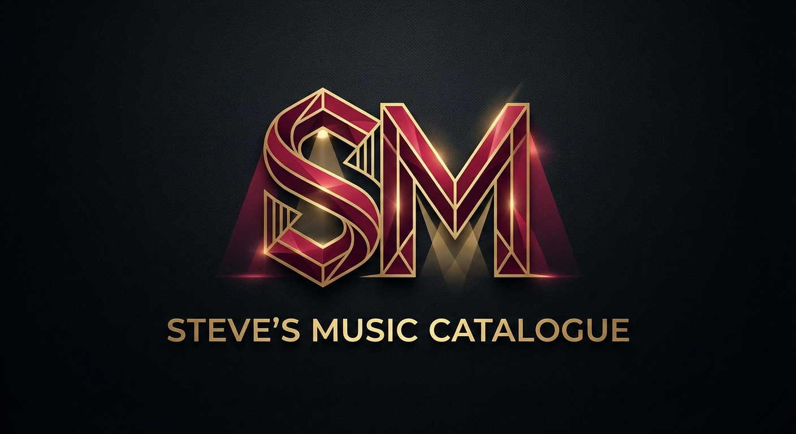

# Steve's Music Catalogue

A premium full-stack web application for cataloguing and browsing musical theatre recordings, featuring Art Deco-inspired design and comprehensive admin capabilities.



## 🎭 Overview

Steve's Music Catalogue is a sophisticated platform designed for managing and exploring a collection of musical theatre recordings. Built with modern web technologies and featuring a luxurious "Gilded Velvet" theme inspired by Broadway's golden age.

**Live Site:** [https://music-catalogue.web.app](https://music-catalogue.web.app)

## ✨ Features

### Public Features
- **Browse Recordings**: View the latest musical theatre recordings with rich metadata
- **Advanced Search**: Search by title, artist, composer, lyricist, or theatre
- **Detailed Views**: Comprehensive recording information including cast, creative team, and venue details
- **Responsive Design**: Beautiful experience across all devices

### Admin Features
- **Recording Management**: Add, edit, and delete recordings with full metadata
- **People Management**: Manage artists, composers, and lyricists
- **Theatre Management**: Maintain venue information
- **User Management**: Role-based access control (Admin, Editor, Viewer)
- **Secure Authentication**: Google Sign-In integration

## 🎨 Design

The application features a custom "Gilded Velvet" Art Deco theme:

- **Primary Color** (Crimson): `#8A1C22`
- **Accent Color** (Gold): `#C5A059`
- **Background** (Silver): `#F5F5F7`
- **Surface** (White): `#FFFFFF`
- **Text** (Charcoal): `#2D2D2D`

**Typography:**
- Headings: Playfair Display (serif)
- Body: Montserrat (sans-serif)

## 🛠️ Technology Stack

- **Framework**: [Next.js 16](https://nextjs.org/) with App Router
- **Language**: TypeScript
- **Styling**: Tailwind CSS
- **Backend**: Firebase
  - Firestore (Database)
  - Authentication (Google Sign-In)
  - Hosting
  - Cloud Functions
- **Build Tool**: Turbopack

## 📋 Prerequisites

- Node.js 18+ and npm
- Firebase CLI (`npm install -g firebase-tools`)
- A Firebase project with:
  - Firestore Database
  - Authentication (Google provider enabled)
  - Hosting enabled

## 🚀 Getting Started

### 1. Clone the Repository

```bash
git clone <repository-url>
cd recording-catalogue
```

### 2. Install Dependencies

```bash
npm install
```

### 3. Firebase Configuration

Create a `.env.local` file in the root directory with your Firebase configuration:

```env
NEXT_PUBLIC_FIREBASE_API_KEY=your_api_key
NEXT_PUBLIC_FIREBASE_AUTH_DOMAIN=your_auth_domain
NEXT_PUBLIC_FIREBASE_PROJECT_ID=your_project_id
NEXT_PUBLIC_FIREBASE_STORAGE_BUCKET=your_storage_bucket
NEXT_PUBLIC_FIREBASE_MESSAGING_SENDER_ID=your_sender_id
NEXT_PUBLIC_FIREBASE_APP_ID=your_app_id
```

### 4. Run Development Server

```bash
npm run dev
```

The application will be available at [http://localhost:3000](http://localhost:3000)

To run on a custom port:

```bash
npx next dev -p 666
```

## 📦 Building for Production

```bash
npm run build
```

## 🚢 Deployment

Deploy to Firebase Hosting:

```bash
firebase deploy --only hosting
```

## 📁 Project Structure

```
recording-catalogue/
├── public/                 # Static assets (logo, favicon)
├── src/
│   ├── app/               # Next.js App Router pages
│   │   ├── admin/         # Admin dashboard and management pages
│   │   ├── login/         # Authentication page
│   │   ├── recordings/    # Recording detail pages
│   │   ├── search/        # Search functionality
│   │   ├── globals.css    # Global styles and theme
│   │   ├── layout.tsx     # Root layout
│   │   └── page.tsx       # Homepage
│   ├── components/        # Reusable React components
│   │   ├── auth/          # Authentication components
│   │   └── ui/            # UI components (Navbar, Modal, etc.)
│   ├── context/           # React Context providers
│   ├── firebase/          # Firebase configuration and utilities
│   ├── hooks/             # Custom React hooks
│   └── types/             # TypeScript type definitions
├── .firebase/             # Firebase build output
├── firebase.json          # Firebase configuration
└── package.json
```

## 🗄️ Data Model

### Recordings
- Title, Release Year, Recording URL, Image URL
- References to Theatre, Artists, Composers, Lyricists
- Timestamps (created, updated)

### People
- Name, Info/Biography
- Can be Artists, Composers, or Lyricists

### Theatres
- Name, City, Country
- Additional information

### Users
- Email, Display Name
- Role: `admin`, `editor`, or `viewer`
- Managed through Firebase Authentication

## 🔐 User Roles

- **Admin**: Full access to all features including user management
- **Editor**: Can manage recordings, people, and theatres
- **Viewer**: Read-only access to public content

## 🎯 Key Features Implementation

### Authentication
- Google Sign-In via Firebase Authentication
- Role-based access control
- Protected admin routes

### Search
- Multi-field search (title, artists, composers, lyricists, theatres)
- Real-time filtering
- Responsive results display

### Admin Dashboard
- CRUD operations for all entities
- Modal-based forms
- Data validation
- Relationship management

## 🤝 Contributing

This is a personal project, but suggestions and feedback are welcome!

## 📄 License

This project is private and not licensed for public use.

## 👤 Author

**Steve**

## 🙏 Acknowledgments

- Design inspired by Art Deco and Broadway theatre aesthetics
- Built with modern web technologies and best practices
- Logo designed with musical theatre motifs

---

**Note**: This application requires Firebase configuration and appropriate permissions to function. Contact the repository owner for access details.
